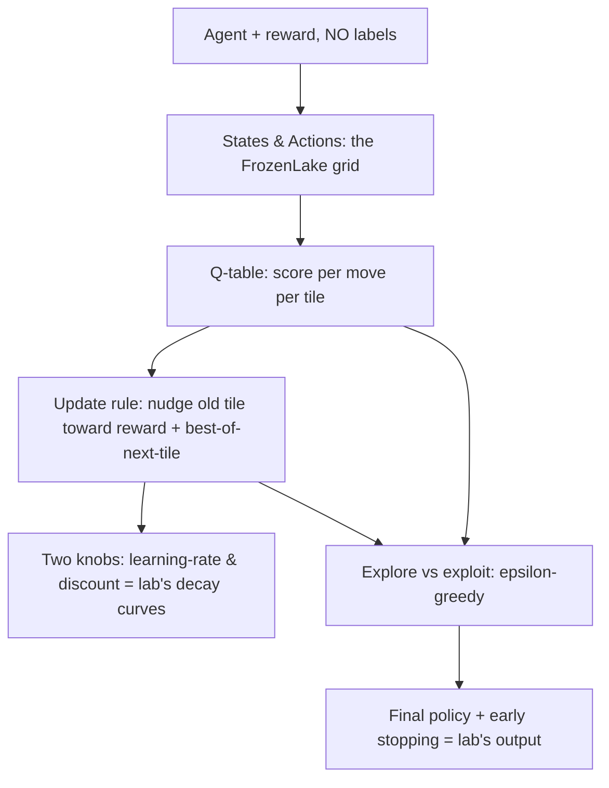
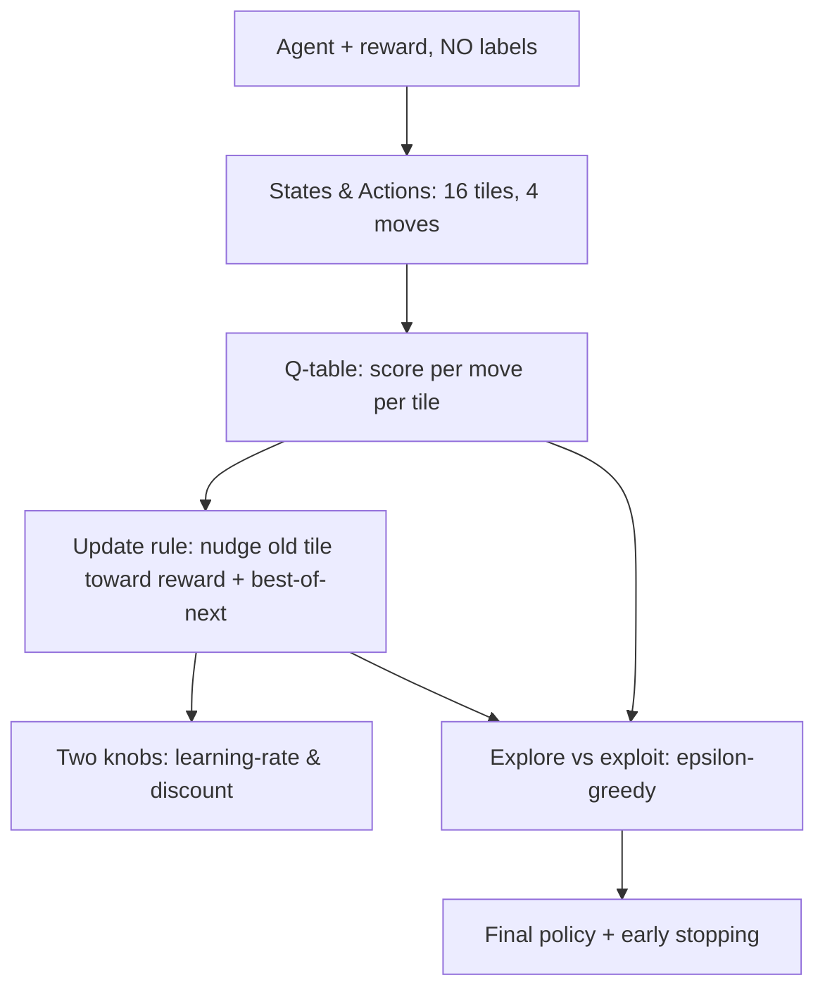

# Q-Learning Foundations

Course context: Lab 1 — Q-Learning on FrozenLake-v1 (Gymnasium). Learner: absolute beginner on RL; shaky on "agent", knows supervised-learning framing vaguely ("data + goal, steps rewarded/punished, optimise total points").

## Planned knowledge graph

_(to be written once plan is approved)_

## Probe log

## 2026-09-17 session

### Phase 1 probes

> Quiz 1: In machine learning, what is an "agent"?
> 1. A program that takes actions in an environment and gets rewards for them
> 2. The computer hardware running the program
> 3. The dataset the program is trained on
> 4. A human who supervises the training

> Quiz 2: In supervised learning, what is in the data that guides the learning?
> 1. An answer/label for each example
> 2. Only the inputs — the goal lives somewhere else
> 3. A score handed out after each step
> 4. A list of rules written by a human

> Quiz 3: In Q-learning, is there anywhere a correct answer for "what the agent should have done"?
> 1. No — nobody ever says the right action
> 2. Yes — the reward is the correct answer for the action just taken
> 3. Yes — a human pre-labels every situation
> 4. Yes — the environment tells you the best move each step

> Quiz 4: After Q-learning training finishes, what has the agent actually learned (what does it keep)?
> 1. A table saying how good each action is in each situation
> 2. The list of rewards it earned along the way
> 3. A record of all the steps it took
> 4. A copy of the environment

Learner replies: Quiz 1 → 1 (correct). Quiz 2 → 1, "the labelled data is the guide" (correct). Quiz 3 → 2 — **WRONG, key misconception**: reward = correct answer for action just taken. Quiz 4 → 1 (correct). No confidence numbers given.

**Diagnostic:** correct on agent, supervised data-as-labels, and that learning produces a table of action-values. Misconception on Quiz 3: conflates reward (a score) with a label (which says the right move). This is THE founding idea of RL to dislodge — its opposite ("nobody ever tells the right action") is the root of everything else. No confidence stated → need to elicit; the wrong pick on the central probe is either a causal shallow guess or a real model. Probe before revealing.

> Learner's explanation for Quiz 3 pick 2: "the agent's job in RL is to max the score so the reward maxes the score so therefore isn't it the thing which drives it so therefore the right answer"
> **Confident (2-3). This is a real belief, not a guess — but it has a hidden step.**

> Teacher correction (the dislodge):
> - Right parts: reward drives the agent; agent's job is to maximize total score. ✓✓
> - Wrong step: "drives" ≠ "answers." Reward is a SCORE (one number: good/bad, how good). It is NOT a label. A label says the correct target ("it's a cat"); a score says only "that went well / that went badly."
> - Analogy: a teacher who only ever says "6/10, try again" but never tells you the right answer. You learn you did badly. You do not know the answer.
> - FrozenLake concrete: reward is +1 only at the Goal tile, 0 EVERYWHERE else (holes, normal ice, even falling in). So most outcomes give literally zero signal. Does "0" say which action was right? No.
> - The clincher: if the reward knew the right action, the Q-table wouldn't be needed — you'd just read answers off the rewards. Q-learning exists precisely because NOBODY knows the right answers; the agent has to discover them by trial and error. The whole lab is the agent building its own answer book.

> Quiz 5 (quiz-check the corrected node): On the ice you pick Left, you slide into a hole, episode ends, reward 0. What did the reward tell the agent?
> 1. That this outcome wasn't the win — nothing about which action was right
> 2. That it should have gone Right instead of Left
> 3. That Left is a bad action, so try the other directions
> 4. That it should have moved opposite to the ice's pull

Learner replies: → 3. **Wrong again, but diagnostic reveals genuinely correct half.** Their reasoning: "because the next step was a sink which ended the episode, so Left which was made to take that sink was a bad action, so it gets more of a reduced score on the previous tile, right?"

**Assessment:** The learner just *described the actual Q-learning mechanism* — marking the previous state-action down because it led to a dead end = the Bellman value propagation. Strong praise due. The remaining error is attribution: the "Left is bad / reduce previous tile" knowledge is NOT delivered by the reward number (0 = same as a safe tile). It's (a) read off the *outcome* (episode ended in a hole — a separate channel from the reward) and (b) EARNED over many episodes, not handed over. Reward is a score with no direction; the Q-table is the reduction of the previous tile, built trial by trial. Also relevant: FrozenLake is slippery — one episode can mislead; condemnning after one trial is overreach.

> Quiz 6 (second quiz-check): Where does the knowledge "Left is a bad move here" actually live, and where does it come from?
> 1. The Q-table — built up across many episodes by averaging the outcomes that followed Left
> 2. The reward of 0, which flags the bad action immediately at that step
> 3. The environment, which announces bad moves as they happen
> 4. The single episode ending in the hole — that's enough to condemn Left for good

Learner replies: 1. **Correct.** The "Left is bad" knowledge lives in the Q-table, earned by averaging over many episodes — reward 0 carried no direction. Misconception from Quiz 3 **dislodged**; node "reward is a score, not a label" = LANDED.

### Phase 1 complete — edge map
| Strand | Floor (has) | Ceiling (runs out) |
|---|---|---|
| Agent | program acting in env for rewards ✓ | — |
| Supervised labels | labels = correct answers ✓ | conflated reward with label → FIXED, quiz-checked ✓ |
| Reward | drives the agent ✓ (wants it inside the mechanism) | attribution of where knowledge lives — FIXED ✓ |
| What's learned | a table of action-goodness ✓ (Q4) | — |

Goal (1b): understand the premise of Q-learning and what the lab did. Math depth: not yet stated — offered at plan approval.

## Plan (presented, awaiting approval)

Approach: premise told as one coherent lesson, built exactly over the learner's own lab. Everything in place is reused as foundation. Payoff of each node is a concrete piece of the notebook — arrows grid, heatmap, the three decay curves, early stopping.

Roots: A landed. B & C mostly landed. New nodes D (the learner's own invented mechanism — "reduced score on the previous tile"), E, F, G derived on top.

## Learned knowledge graph

_(written when final node lands — after plan approval)_

## 2026-09-17 lesson (plan approved; math depth = "the feel", not arithmetic)

### Node B (States & Actions) + Node C (Q-table)
Motivate: to score moves, the agent needs to know where it is (state) and what it can do (action). FrozenLake = 4×4 grid of ice; skater on a tile.
- State = the tile (one of 16). Action = a direction tried (Left/Down/Right/Up, 4 choices).
- Q-table = 16 rows × 4 columns; cell = "how good is trying THIS move from THIS tile." Starts all zeros (no opinion). Training fills it. This is exactly the notebook's `Q_table` / `optimal_Q`, and the arrows grid + heatmap are drawn FROM it.
- Connect: `greedy_action(q_values)` reads the 4 numbers for a tile and picks the best = table use in life.

> Quiz 7 (combined B+C check): FrozenLake — the agent stands on a tile and its table shows a row of 4 numbers for that tile. Each number says what?
> 1. How good it is to try that one direction from this tile
> 2. How long ago the agent last moved that direction from this tile
> 3. How far this tile is from the goal, no matter which move
> 4. How often that move worked anywhere on the grid

Learner replies: 1. **Correct.** Nodes B (states/actions) and C (Q-table) = LANDED.

### Node D — The update rule (the centerpiece)
Motivate: a table of zeros is worthless; where do numbers come from? The agent takes one step, learns one thing, writes it in.
- Their own earlier insight is the whole rule: "Left led to a hole → reduce that tile's Left score."
- Feel of the rule: after a move from X to X', nudge the X-move number a bit toward (reward r + best of the 4 numbers in row X'). "Best of where you landed" = how attractive the new tile is → value flows BACKWARD from the goal one tile per encounter; the goal's +1 creeps back.
- Partial, never overwrite: old opinion slides toward new evidence, doesn't jump.
- Falling in a hole: hole tile's best = 0 (dead end), so X-Left partially sinks toward 0. Their prophecy confirmed.
- This update in code is the lab's Bellman step ("guarantee asymptotic Bellman convergence") — name-dropped, shape only, no arithmetic (learner chose "feel").

> Quiz 8 (check D): Standing on tile X you try Left, slide into a hole, episode ends. Tile X's "Left" number is currently 0.4. What should the update do?
> 1. Nudge it down toward 0 — this move leads to a dead end
> 2. Nudge it up — at least you learned something
> 3. Leave it — the reward was 0, same as a normal step
> 4. Set it to exactly 0 in one stroke

Learner replies: 1. **Correct.** Node D (update rule) = LANDED.

### Node E — The two knobs (learning rate + discount)
Motivate: "nudge a bit" begs two questions: HOW big a bit? And does a reward far ahead count fully today?
- **Learning rate α** = size of each nudge. Big = fast, jumpy, chases recent noise. Small = smooth, slow. Lab: starts 0.8, decays to 0.05 (Robbins-Monro) = big early steps, gentle late ones once near the truth.
- **Discount γ** = how much a future +1 counts today. 0.95: +1 one tile away → worth 0.95 now; five tiles away → 0.95⁵ ≈ 0.77; ten → 0.95¹⁰ ≈ 0.60. This power-of-0.95 decay IS the lab's "0.954$^d$ Bellman discount gradient" and its heatmap verification (Goal 1.000 → Start 0.774). γ=1 = patient; γ=0 = immediate-rewards-only.
- Connect: α lives in the update line (the multiplier on the nudge); γ multiplies "best of the next tile."

> Quiz 9 (check E, the discount): Two tiles can move to the Goal in one step (Path A) or five steps (Path B). With γ = 0.95, which tile's Q-value is pushed bigger by the goal's +1?
> 1. The tile one step away — value shrinks as the goal gets farther
> 2. The tile five steps away — longer path earns more credit
> 3. Both equally — discount doesn't depend on distance
> 4. The start tile — value flows backward undiminished

Learner replies: 1. **Correct.** Node E (two knobs) = LANDED. The three curves in the lab now have names: α decay (nudge size), γ fixed 0.95 (discount gradient), ε decay (next).

### Node F — Explore vs exploit (ε-greedy)
Motivate: the update rule learns only from moves actually taken. An agent that always picks its current-best number never visits the moves it hasn't sampled → trapped by its own ignorance. Worst case: all zeros, ties forever, learns nothing.
- Exploit = take the biggest number in the row (best known move). Explore = take a random move to gather data.
- ε-greedy: with probability ε, act randomly; otherwise, exploit. ε = "how often you step off the known path to look around."
- Early ε high → scrappy exploring, reward curve jagged/low. ε decay ("decoupled exponential decay", 400-episode horizon in the lab) → settles into exploiting → the lab's rolling-100-average plot shows exactly this: oscillating early, plateau once stable.
- Connect: exploration is what first DISCOVERS the goal's +1 (a greedy-from-day-1 agent on an all-zero table picks arbitrary ties forever). Exploration feeds the update rule; exploitation pays its rent. Both needed.

> Quiz 10 (check F): Mid-training, ε has shrunk a lot — most moves are the best-known one. Why keep a small but non-zero ε?
> 1. Table numbers are built from sampling — under-sampled moves might secretly be better; a little randomness finds them
> 2. Random moves earn higher rewards than planned ones
> 3. The table needs to keep growing bigger
> 4. Random steps help the computer cool down

Learner replies: **X (don't know).** Genuine gap, not a misconception. The link "table numbers are estimates built from samples → numbers get trustworthy only with enough samples → ε keeps re-sampling" didn't land. Re-teach with a concrete unlucky-sample story, then re-check with Quiz 11.
Key elaboration to give: two moves, Up tried once (bad luck) vs Right tried ten times (decent) — with ε=0 the agent only ever repeats Right and never re-measures Up; ε>0 keeps sampling Up until the number corrects to truth. Also bridge: the lab's final stage evaluates with ε=0 ("zero-exploration policy extraction") but trains with ε>0 for exactly this reason.

> Quiz 11 (re-check F): a tile's "Up" = 0.2 (tried once, bad luck) and "Right" = 0.3 (tried ten times). Why would ε > 0 eventually fix this?
> 1. Random tries of Up keep adding samples until Up's number reflects its true value
> 2. ε makes the table smaller so bad numbers drop out
> 3. ε lowers Right's number automatically every episode
> 4. ε stops all learning so the numbers freeze

Learner replies: 1. **Correct.** Node F (explore/exploit, ε-greedy) = LANDED.

### Node G — Final policy + early stopping
Motivate: training ends; the table is full. What is the agent now? It's the rule "from each tile, take the move with the biggest number" — a policy. Deterministic, no exploration. Extraction = for each tile pick argmax row → arrow grid; heatmap = per-tile best value. Both drawn from the SAME table.
- The policy can be tested at any moment (run it greedily, count success rate) — tests need no exploring/updating.
- Early stopping: once the greedy policy passes ≥98% on repeated validation checks (4 consecutive), the table is already good; remaining budget episodes add nothing → stop. Compute savings up to 97.5% (the lab's "requested vs trained episodes" figure) — the plateau in the reward curves is exactly this.
- Loop closed: build table by trial (explore + update + knobs) → read table to act. Root A → G: nobody told the agent anything; it wrote and then read its own answer book.

> Quiz 12 (check G, policy extraction): After training the lab "extracts the policy." Concretely, what is that?
> 1. For each tile, lock in the move with the biggest number — that fixed rule is the policy
> 2. Delete the table and average every number into one
> 3. Run more episodes to double-check the reward values
> 4. Replace the table numbers with the reward seen in the last episode

> Quiz 13 (check G, early stopping): The lab stops when the greedy policy passes ≥98% on validation checks. Why can that check be trusted?
> 1. The policy is testable anytime without exploring — run the fixed best-move rule and count wins
> 2. Because ε was high that day, so the check is extra lucky
> 3. Because the table's numbers never change after the first episode
> 4. Because each validation re-trains a fresh agent

Learner replies: Quiz 12 → 1 (correct), Quiz 13 → 1 (correct). Node G (policy + early stopping) = LANDED. THEN asked three questions, answered in chat:
- "greedy policy" = `greedy_action` (argmax of row, uniform tie-break) applied at every tile; ε=0 extreme; "policy" = the full per-tile rule. Grounded in their cell 3 / cell 7 / `evaluate_policy` (pure exploitation).
- Why FrozenLake: RL hello-world; 16×4 = 64 values → full-table visualization, hand-verifiable math, seconds of training; still exercises sparse reward, terminals, dead ends, exploration.
- Why `is_slippery=False`: deterministic transitions → exact 0.95^d gradient, stable eval (100% success reproducible), honest early-stopping; slippery would smear values into noisy expectations and wreck every "verified" claim. Standard for a "theory visible" lab. Verified against cell 9 code (`is_slippery=False` in train + eval calls).

## Learned knowledge graph (session complete)

All nodes landed (solid edges): A (Q3/Q5/Q6), B/C (Q7), D (Q8), E (Q9), F (Q10 X → re-taught → Q11), G (Q12/Q13).

## Misses recap (revisit next session)
1. Reward = "the right answer" misconception — dislodged via teacher/score analogy + "0 is the same number as a safe step" (Q3, Q5, Q6). Reconfirm later.
2. Attribute of where "Left is bad" lives (reward vs outcome vs table) — fixed Q6.
3. Why ε stays > 0 (under-sampled moves) — Q10 X, re-taught, landed Q11.
4. NEW: greedy-policy vocab + FrozenLake/slippery rationale — clarified today; worth a warm-up recall item.

## Review queue

- [ ] reward is a score, not a label — **MISSED in free recall** — due 2026-09-18
- [ ] why keep ε > 0 (under-sampled moves) — recalled solid — due 2026-09-24
- [ ] update rule: nudge toward reward + best-of-next — recalled, inner shape partial — due 2026-09-20
- [ ] discount γ shrinks value with distance (0.95^d) — **MISSED in free recall** — due 2026-09-18
- [ ] learning rate α (nudge size / Robbins-Monro) — **MISSED in free recall** — due 2026-09-18
- [ ] greedy policy = argmax best-number rule, ε=0 — recalled implicitly — due 2026-09-20
- [ ] why is_slippery=False in the lab — not recalled — due 2026-09-20

### Close — brain-dump free recall (2026-09-17)
Learner recalled: RL framing ✓, Q-table all-zeros start ✓, backward update of the tile-before + population over episodes ✓, early stopping on wasted budget ✓, explore-then-decay ✓ (ε; possibly blended with α).
**Missing from recall:** (1) THE founder node — reward is a score, no labels/no right answers. (2) Entire E node — discount γ and (ambiguously) learning rate α. Inner shape of the update rule ("+ best of next tile") also thin.
→ Re-taught both gaps in chat; learner re-produced both in own words:
1. "it does not know the right answer it just tries to max the score" — **correct.** Node A re-confirmed.
2. "the reward gets discounted the further back by 0.95^n where n is the number of steps backwards" — **correct.** Node E (discount) re-confirmed. (Note: 0.95^d of the lab is exactly this; confirmed the gradient claim connects.)
Learning rate α still softest (mentioned only parenthetically in re-teach) → due soon.
6 of 7 nodes now re-confirmed at close; early stopping confirmed (implicitly), greedy-policy vocab + is_slippery rationale reviewed via Q&A but not in recall.

## Review queue

- [ ] reward is a score, not a label — recovered at close — due 2026-09-20
- [ ] why keep ε > 0 (under-sampled moves) — recalled solid — due 2026-09-24
- [ ] update rule: nudge toward reward + best-of-next — recalled, inner shape partial — due 2026-09-20
- [ ] discount γ shrinks value with distance (0.95^d) — recovered at close — due 2026-09-20
- [ ] learning rate α (nudge size / Robbins-Monro) — **MISSED in recall, not re-produced** — due 2026-09-18
- [ ] greedy policy = argmax best-number rule, ε=0 — recalled implicitly — due 2026-09-20
- [ ] why is_slippery=False in the lab — not recalled — due 2026-09-20